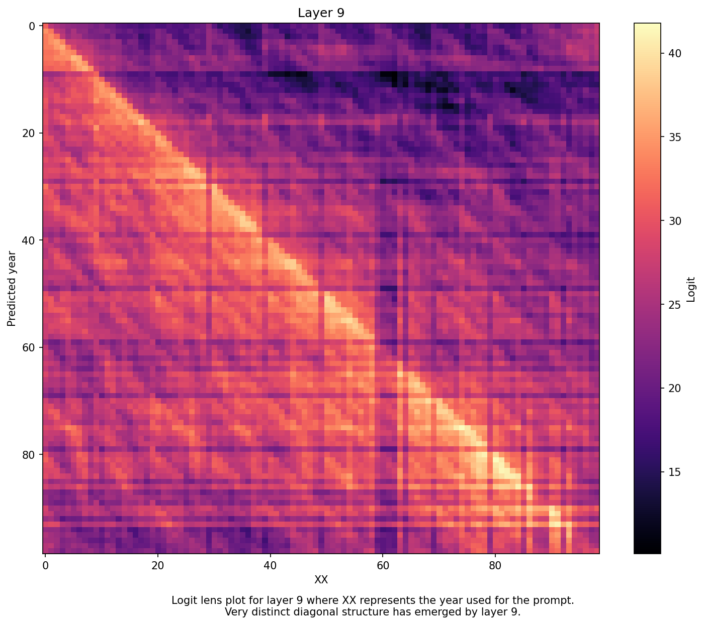
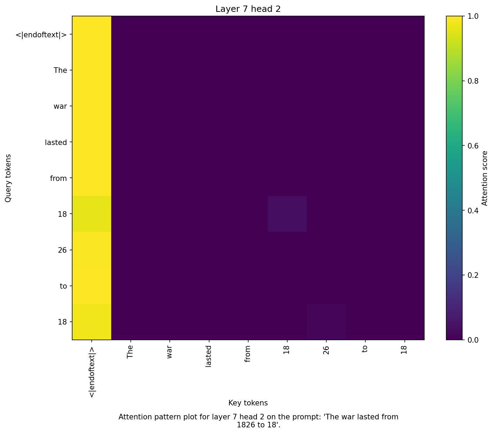
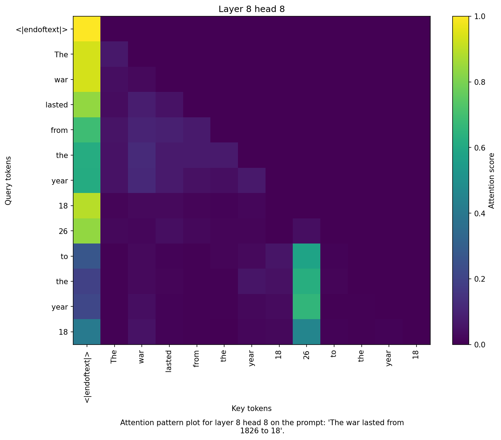
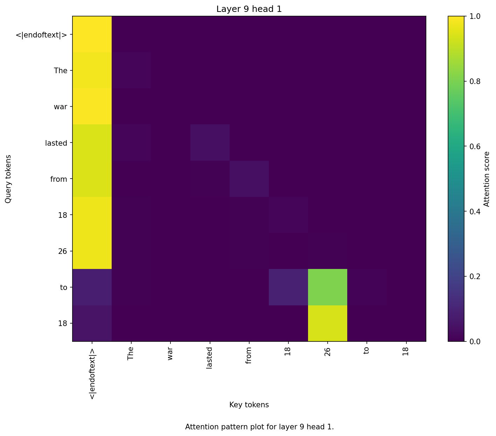
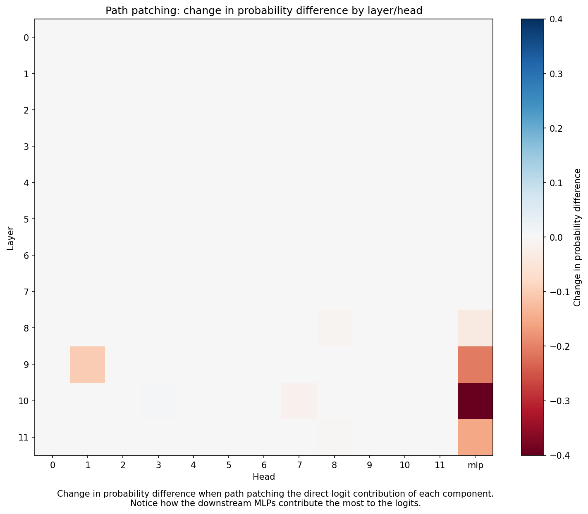
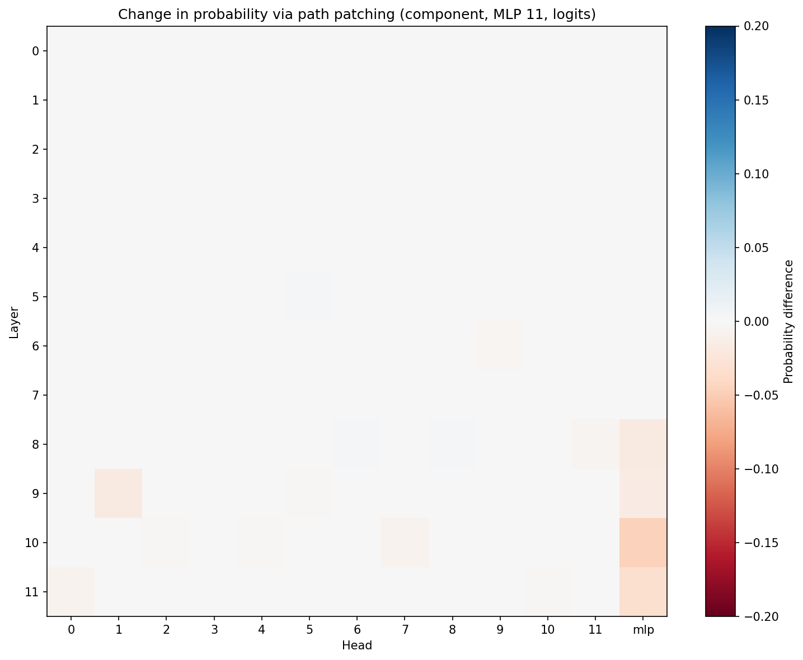
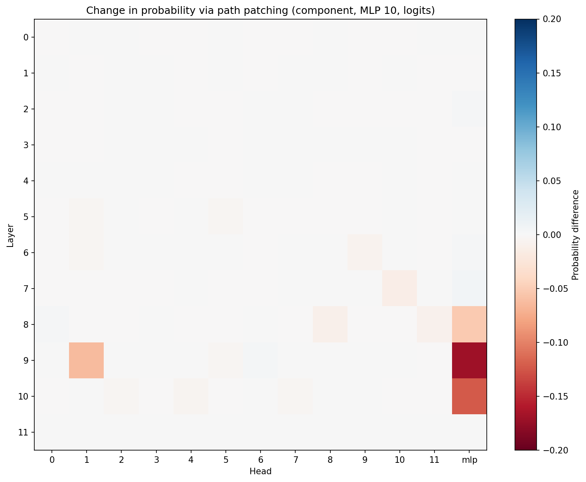
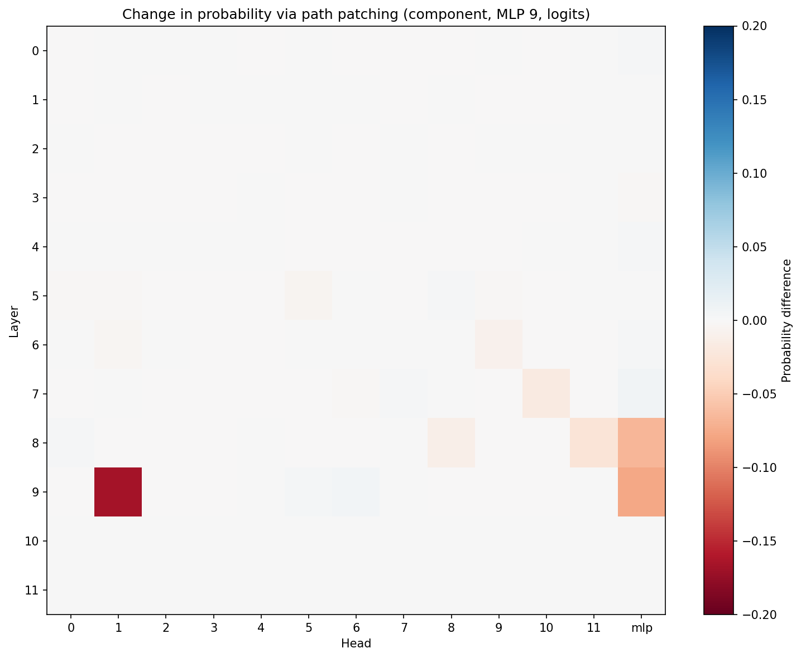
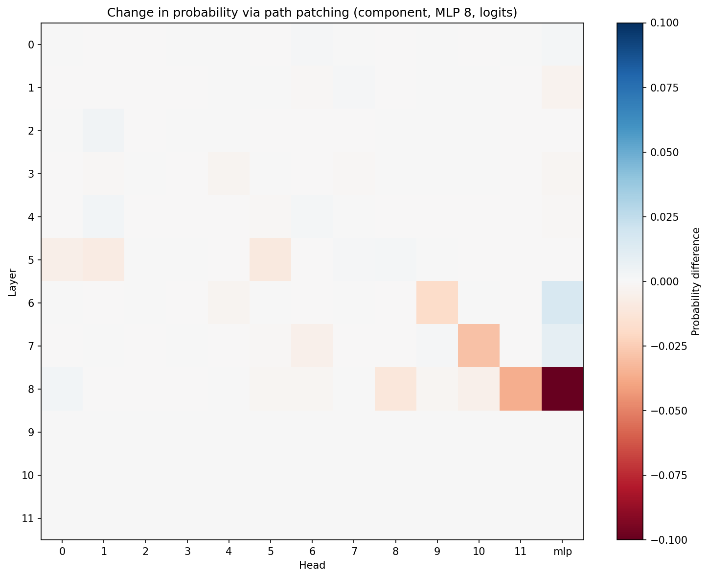

# Greater than capability analysis in GPT-2 small

## Week One

The objective of the first week of this project was to identify important components and begin developing an initial map of the circuit computing the greater than capability in GPT-2 small. Through ablation tests and logit lens visualization, we outline a higher level understanding of what components are necessary for the task.

### Methods and Setup

All experiments used the TransformerLens library developed by Neel Nanda. The GPT-2 Small model was loaded through TransformerLens, and inferences were run on prompts of the form "The war lasted from the year 18XX to the year 18" where XX was a two digit number spanning 01 to 99. Since numbers ending in 00 are more common than numbers with other ending digits, we do not consider XX=00 to try to measure the natural behavior of the model. The prompt is crafted to provide a natural language setting for a mathematical task, intending to capture how the model may have encountered such a task in its training data; more prompt formats are explored in the ```setup``` folder of the repository. A possible extension to explore in week three of the project is to see how this circuit performs in other natural language greater than settings.

### Logit Lenses

The first thing that we analyze is the logit lens per layer of the model. This was done by extracting the output of each layer's and then applying the final normalization layer and outward projection to get the logits. Logits for every prompt XX=01 to XX=99 were plotted to visualize the model's behavior on the overall task. Notably, the logit lenses have largely horizontal structure in layers 1-5, indicating that these layers do not perform the greater than computation (we would expect the predictions to begin developing a diagonal structure once the model is properly performing greater than). Diagonal structure first appears in layer 5, and becomes fully refined by layer 9, suggesting that these layers are where GPT-2 compute greater than.

<p align="center"></p>

### Ablation Tests

To confirm our findings, we run ablation tests on the attention heads. The baseline accuracy of GPT-2 small is 94 correctly predicted prompts out of 99. First we run ablation tests layer by layer, zeroing out the attention outputs of every head per layer. Interestingly, we do not see a significant drop in model accuracy when we independently ablate the attention layers 5 through 8, but see significant decrease in accuracy after ablating layers 0 and 9. Since our logit lens indicates that layers the layers 5 through 8 should aid in computing greater than but the attention ablation tests do not reveal any notable drops in performance, we suspect that the attention outputs of these layers must be indirectly contributing to the circuit.

Going further in our attention head analysis, we are interested to see which localized attention heads are a part of the circuit. By ablating attention heads one by one, we find that layer 0 head 10 and layer 9 head 1 play a big role, with their ablated accuracies being 18 out of 99 and 90 out of 99 respectively. To investigate further, we try ablating every attention head in layer 9 except for head 1 and see that the model preserves its performance. The role of layer 0 appears to be largely localized in head 10, but ablating every head except for head 10 causes model accuracy to plummet to 0. We will investigate the role of the attention heads in layer 0 in greater detail later, for now it should just be noted that attention layer 0 is a key part of the greater than circuit.

Next, we investigate ablating the MLPs for each layer. Here we find that the greater than circuit is significantly more MLP dependent than it is attention dependent. Ablating MLPs 0, 9, and 10 independently yields accuracies of 0, 77, and 88 respectively out of 99 prompts. An obvious takeaway here is that MLP 0 is a non-negotiable component of the greater than circuit, as it likely processes basic positional information that is used throughout the computation. Furthermore, it is also evident that layer 9's MLP handles most of the heavy lifting with the greater than computation. Inspired by our previous results suggesting that attention layers 5 through 8 indirectly contribute to the greater than computation, we try ablating attention layers 7 and 8 along with MLP 9. These layers actually interact superadditively, with the model accuracy dropping to 58 out of 99, as opposed to the baseline 77 out of 99 when ablating just MLP 9. Again, the roles of these upstream layers with regards to MLP 9 will be explored in greater detail in week two.

### Attention Analysis

Finally, we visualize the attention patterns of the attention heads from important layers in our circuit. Plotting the attention patterns of layer 0 yields exactly what we would expect from an early layer that propogates basic positional information: some heads attend to the endoftext token, while some attend to the last token. When studying layers 7, 8, 9, we begin to see much more interesting structure. The heads in layer 7 almost exclusively attend to the first token, suggesting that information written to the residual stream from past layers is stored in the endoftext token. In layer 8, we see that attention heads 6 and 8 begin to attend to the year token in the prompt, a pattern which continues into layer 9 where a much more refined attention head 1 (which we identified as important earlier) does the exact same thing. As such, these later layers process year information that is directly used in the greater than computation.

<p align="center"><p>

## Week Two

This week will focus on confirming our initial findings from week one. Our goal is to concretely identify the components of the circuit and understand the flow of information through the model. This will be achieved through iterative path patching where we experiment on the different edges in the computational graph of GPT-2 small. A number of things need to fundamentally change in our experiments to achieve clean results. Notably, our use of binary accuracy in week one will not be effective anymore since it does not reflect internal shifts in the model's capabilities. Following the procedure of the original Hanna et. al paper, we will measure the difference in the probabilities that the model assigns to years greater than XX and probabilities that the model assigns to years less than or equal to XX. We futher note that we normalize these probabilities across the probabilties of the output tokens 01, ..., 99, not their raw sum across the vocabulary space because we are only measuring the models accuracy across these specific output tokens.

### Path Patching

The first thing that we will path patch is the direct logit contribution of each component, computed by taking the final residual layer, subtracting the clean contribution of the component, and replacing it with the corrupted contribution of the component. Following the practice of the original paper, the corrupted input with be the prompt "The war lasted from the year 1801 to the year", to encourage the corrupted outputs to contribute to outputs along an incorrect year span. We will consider the 144 attention heads and 12 MLP layers as candidates for components. 

<p align="center"><p>

The results of our direct logit path patching indicate that our hypothesis that the circuit is MLP dependent was correct. MLPs 8-11 lead to the greatest drop in probability difference, indicating that these components are what directly contribute to the model's greater than computation. Tracing the information flow, we path patch every component upstream from these MLPs through each MLP. What this means is that we patch the path (component, MLP X, logits), where X is one of 8, 9, 10, or 11. 

<p align="center"><p>

Path patching through MLP 11 suggests that it depends largely on the MLPs upstream from it, hence we look deeper into the paths through MLPs 8, 9, and 10. The next natural step is to inspect MLP 10, since it is directly upstream from MLP 11. Again we find that MLP 10 depends largely on the MLPs upstream from it, and seemingly on layer 9 head one. We hold off on claiming that this attention head contributes directly to MLP 10 by first inspecting MLP 9. Looking at MLP 9's path patching heatmap, it becomes clear that layer 9 head one contributes to the circuit through MLP 9. Similar observations on MLP 8 suggest that the attention heads l5.h1, l5.h5, l6.h9, l7.h10, l8.h8, and l8.h11 contribute to the circuit through MLP 8. This is an identical finding to the orignal paper's important attention heads to MLP 8. 

With these components identified, we can perform relevant attention head analysis. Upon insepction, we see that l5.h1 and l5.h5 attend almost entirely to the <endoftext> and the year tokens, suggesting that this is a starting point for when the model begins to process the year information used in the greater than computation. This pattern remains true when looking at l6.h9 and l7.h10. Again, both of l8.h8 and l8.h11 attend to the <endoftext> token and the year tokens, just in a much more clear manner. We already looked at l9.h1 in week one. The common theme throughout these attention heads is clear: all of them attend to the <endoftext> token and the year tokens, suggesting that the model cumulates important input information through the <endoftext> token, and relies on the heads which process year information to provide the necessary input to the MLPs at the end of the circuit. Then, it makes sense why ablating a single layer in our week one tests did not immediately kill model performance; since there are multiple attention heads across different layers in our circuit which read in the year information, ablating just one layer does not completely disable the greater than circuit.

Now we have a complete idea of what components and through what paths our circuit computes greater than through. The upstream attention heads feed relevant information through MLPs 8 and 9, which in turn continue to propogate information downstream via the later MLPs. 

# Week Three

The original paper notes that when they ran generalization tests on new prompt formats, that one of their new tasks required MLP 7 and two additional attention heads. Specifically, they mention MLP 7 and two extra attention heads were needed for such prompts. In this week, we will identify the new additions to the circuit, and analyze the need for this difference.